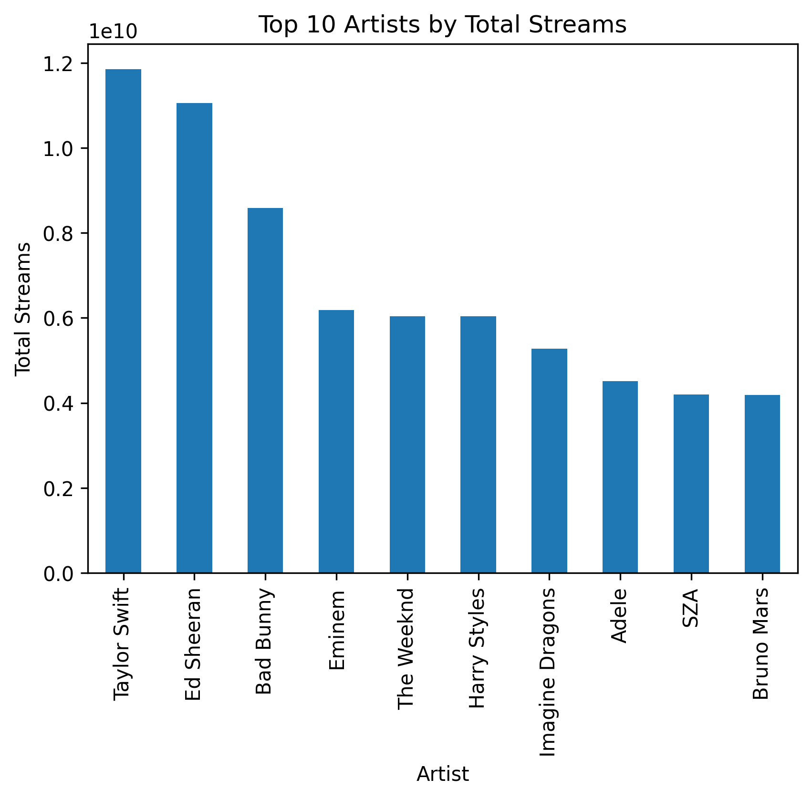

# Spotify Song Popularity Prediction

##  Project Overview

This project builds a complete machine learning pipeline to analyze and predict song popularity using Spotify data. The goal is to determine whether a song will be a "hit" based on its audio features such as energy, danceability, tempo, and others.

The pipeline follows four main stages: exploratory data analysis (EDA), supervised learning, unsupervised clustering, and ensemble modeling. Each stage builds on the previous one, forming a connected workflow from raw data to final model evaluation.

---

##  Dataset

* **Name:** Spotify 2023 Dataset
* **Source:** https://www.kaggle.com/datasets/nelgiriyewithana/top-spotify-songs-2023
* **License:** Public dataset (Kaggle)

### Description

The dataset contains information about popular Spotify songs, including features such as danceability, energy, tempo, valence, and the number of streams. These features are used to explore patterns in music popularity and build predictive models.

---

##  Installation & Setup

### 1. Clone the repository

```bash
git clone https://github.com/mrapo2007-svg/ml-spotify-project.git
cd ml-spotify-project 
```

### 2. Install dependencies

```bash
pip install -r requirements.txt
```

---

##  How to Run the Project

Run the notebooks in the following order:

1. **T1_EDA.ipynb**

   * Cleans and explores the dataset
   * Outputs: `data/cleaned.csv`

2. **T2_Supervised.ipynb**

   * Builds classification models
   * Outputs: `models/supervised_best.pkl`, `reports/task2_results.csv`

3. **T3_Unsupervised.ipynb**

   * Performs clustering and PCA visualization
   * Outputs: `data/clustered.csv`

4. **T4_Ensemble.ipynb**

   * Trains ensemble models and compares performance
   * Outputs: `reports/model_comparison.csv`

---

##  Model Results

| Model               | Accuracy | F1 Score |
| ------------------- | -------- | -------- |
| Logistic Regression | 0.987805 | 0.988235 |
| Decision Tree       | 0.993902 | 0.994152 |
| Random Forest       | 0.993902 | 0.994152 |
| Gradient Boosting   | 0.993902 | 0.994152 |


---

##  Key Insights

* Song popularity is not evenly distributed; a small number of songs receive significantly more streams.
* Features like energy and danceability show relationships with popularity.
* Clustering revealed distinct groups of songs based on audio characteristics.
* Ensemble models (Random Forest, Gradient Boosting) generally performed better than single models.
* The inclusion of cluster labels slightly improved prediction performance.

---

##  Repository Structure

```text
your-repo-name/
│
├── data/
│   ├── raw/
│   ├── cleaned.csv
│   ├── clustered.csv
│
├── notebooks/
│   ├── T1_EDA.ipynb
│   ├── T2_Supervised.ipynb
│   ├── T3_Unsupervised.ipynb
│   ├── T4_Ensemble.ipynb
│
├── models/
│   └── supervised_best.pkl
│
├── reports/
│   ├── model_comparison.csv
│   └── (figures)
│
├── requirements.txt
└── README.md
```

---

##  Example Visualization




---
